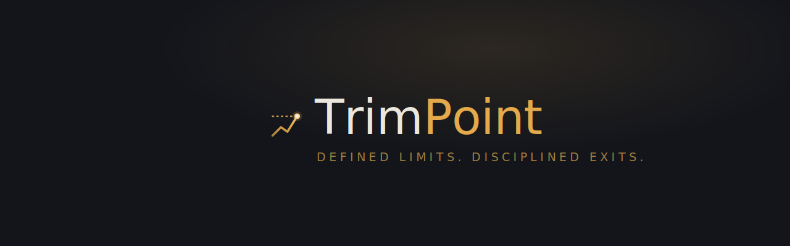

<p align="center">
  
</p>

A small, self-hosted **position-ceiling tracker**. You set the maximum weight any single holding may reach; it shows where each position sits, flags the ones over your line, and can notify you when one crosses it.

> **Informational only.** It tracks your positions against thresholds *you* define and reminds you to execute *your own* plan. It makes no recommendations and is **not financial advice**.

## What it does

- **One screen, your rules.** Each holding shows its weight, how far it is from its ceiling, and — if it's over — the trim your own plan calls for. Holdings below their floor read "underweight."
- **Built for the phone — and the desktop.** Holdings are a tap-to-expand chip grid, so a thirty-name portfolio stays a short, scannable list and anything over its ceiling glows. On a wide screen it opens into a two-column dashboard, allocation donut and value trend side by side.
- **Per-position limits.** Set a default ceiling/floor for everything, then override either on any single position (e.g. keep a speculative name under 5%, a core one under 20%).
- **Crypto, kept separate.** Coins live in their own section — their own doughnut, their own ceiling/floor — weighed against your crypto only, never blended with stocks. The section appears once you add a coin, with an **Update crypto prices** button that looks up live quotes by ticker — most coins on CoinGecko resolve automatically, and anything it can't find keeps the price you enter. *(Background snapshots and alerts still cover stocks; crypto history and crypto alerts are on the roadmap.)*
- **Notes.** Jot one line per position on *why* you set that ceiling; it shows on the card and rides along in the alert.
- **Dry powder.** Set a minimum cash %; the dashboard and notifications flag it if cash drops below your floor.
- **Drift & history.** A daily weight snapshot powers a sparkline and a 30-day "drift" readout on each position — so you can tell a temporary spike from a structural climb. Stored in one bounded file; no database.
- **Optional login.** Gate the whole app behind a single password — or leave it open for LAN use.
- **Your API key stays server-side.** The browser never sees it; price requests are proxied through the server.
- **Today's move in context.** Each holding shows its previous close and the day's percent change beside the current price, so a ceiling reading is easy to size up at a glance.
- **Notifications.** On a schedule, the server pings you (ntfy / Discord / any webhook) *only* when a holding crosses its ceiling or cash dips below your floor.
- **Syncs across devices.** Config lives in one file on the server, so your phone and desktop see the same thing.

## How it works

A single zero-dependency Node process (built-ins only — no frameworks, no database) serves the page, proxies [Finnhub](https://finnhub.io) stock quotes and [CoinGecko](https://www.coingecko.com/en/api) crypto prices, reads/writes one `config.json`, runs a periodic threshold check, and (optionally) gates access with a signed session cookie. Prices are cached briefly to avoid redundant calls.

```
trimpoint/
├── server.js                 # the whole backend (~250 lines, no dependencies)
├── public/
│   ├── index.html            # the app
│   ├── login.html            # the sign-in page (used only if a password is set)
│   ├── favicon.svg           # browser-tab icon
│   └── apple-touch-icon.png  # home-screen icon
├── assets/                   # brand kit — logo mark, lockups, banner
├── .github/workflows/
│   └── docker.yml            # builds & publishes the image to GHCR
├── package.json
├── Dockerfile · docker-compose.yml · .env.example · .gitignore · LICENSE
```

Runtime data (`config.json`, `history.json`) lives on the mounted volume, not in the repo.

## Quick start (Docker)

1. Grab a free Finnhub key: https://finnhub.io/register
2. Copy `.env.example` to `.env` and set `FINNHUB_KEY` (and, if you want a login, `AUTH_PASSWORD`).
3. Run it:

```bash
docker compose up -d --build
```

Open `http://localhost:8080` (or your server's IP). Add your positions, set your ceiling, hit **Refresh prices**.

## Authentication

TrimPoint is **single-user by design** — one password gates the whole app, no accounts.

- **Turn it on:** set `AUTH_PASSWORD`. Leave it blank to run open (fine on a trusted LAN).
- **Keep logins across restarts:** set `SESSION_SECRET` to a long random string (`openssl rand -hex 32`). If you skip it, a random secret is generated at startup and you'll just re-login after a restart.
- **Over HTTPS:** set `COOKIE_SECURE=true`.
- **Forgot the password?** There is no reset flow, on purpose — change `AUTH_PASSWORD` in `.env` and restart the container. That's the reset.

The password is compared in constant time and never leaves the server; the browser only ever holds a signed, HttpOnly session cookie (30-day expiry).

## Unraid

- **Compose Manager plugin:** drop this folder into your appdata, point a stack at `docker-compose.yml`, start it. Change the volume to e.g. `/mnt/user/appdata/trimpoint:/data`.
- **Or Add Container:** Repository = your built/pushed image, port `8080`, path container `/data` → `/mnt/user/appdata/trimpoint`, and the env vars from `.env.example`.
- Reach it on your LAN at `http://TOWER-IP:8080`; "Add to Home Screen" from that URL for a phone icon.

## Build & publish (GitHub Actions → GHCR)

The included workflow (`.github/workflows/docker.yml`) builds the image and pushes it to the GitHub Container Registry on every push to `main` (and on `v*` tags). No setup beyond having the repo:

1. Push this folder to a GitHub repo named **`trimpoint`** (public is simplest).
2. The Action runs automatically and publishes `ghcr.io/YOUR_USERNAME/trimpoint:latest`. (First run: the package may default to private — make it public under the repo's *Packages*, or `docker login ghcr.io` on your server.)
3. On Unraid, set the compose `image:` to `ghcr.io/YOUR_USERNAME/trimpoint:latest` and drop the `build: .` line — now it pulls the prebuilt image instead of building locally. Tag a release (`git tag v1.0.0 && git push --tags`) to get versioned images.

## Notifications

| Target | `NOTIFY_KIND` | `NOTIFY_URL` |
|---|---|---|
| ntfy (easiest) | `ntfy` | `https://ntfy.sh/your-unique-topic` |
| Discord | `discord` | your channel webhook URL |
| Anything else | `webhook` | any endpoint; gets JSON `{ title, body }` |

`CHECK_INTERVAL` controls how often (minutes); `0` disables it. The alert restates *your* plan and includes your note — e.g. "AAPL is 26.1% — your plan: trim ~5 shares toward 20% into SCHD. Note: lock gains for the house fund."

## Config (env)

| Var | Default | Notes |
|---|---|---|
| `FINNHUB_KEY` | — | **required**; server-side only |
| `COINGECKO_KEY` | — | optional; free CoinGecko Demo key for higher crypto rate limits |
| `PORT` | `8080` | |
| `DATA_DIR` | `/data` | mount this; use `./data` for local `npm start` |
| `QUOTE_TTL` | `45` | quote cache, seconds |
| `CHECK_INTERVAL` | `60` | check interval, minutes (`0` = off) |
| `NOTIFY_KIND` | `off` | `ntfy` \| `discord` \| `webhook` \| `off` |
| `NOTIFY_URL` | — | the POST target |
| `HISTORY` | `on` | daily weight snapshots for drift; `off` to disable |
| `AUTH_PASSWORD` | — | set to require login; blank = open |
| `SESSION_SECRET` | random | set for logins that survive restarts |
| `COOKIE_SECURE` | `false` | `true` when served over HTTPS |

Stock data comes from [Finnhub](https://finnhub.io) and crypto data from [CoinGecko](https://www.coingecko.com/en/api), both credited in the app footer. Both free tiers are for personal, non-commercial use — Finnhub's signup asks you to confirm you're a non-professional user, and CoinGecko asks that its credit be displayed (it is). Running TrimPoint commercially would require a paid plan from each.

## Local development

```bash
DATA_DIR=./data FINNHUB_KEY=xxxx npm start
```

## Security notes

- Secrets (`FINNHUB_KEY`, `AUTH_PASSWORD`, `SESSION_SECRET`, notification URL) live in `.env` (git-ignored) and never reach the browser.
- With a password set, every page and API route is gated except the login page and the health check. Still, if you expose it beyond your LAN, put it behind your own reverse proxy / HTTPS / VPN.

## Support the project

TrimPoint is free and open-source, with no business model behind it. If it helps you stay disciplined and you'd like to chip in:

[☕ Buy me a coffee](https://buymeacoffee.com/gillberg1111)

The same button sits at the bottom of the app.

## Acknowledgments

TrimPoint was built collaboratively with [Claude](https://claude.ai), Anthropic's AI assistant, across many sessions. The code is largely Claude's; the investing approach it encodes, the rules, the brand direction, and the real-world testing are the maintainer's.

Market data is provided by [Finnhub](https://finnhub.io) (stocks) and [CoinGecko](https://www.coingecko.com/en/api) (crypto).

## License

MIT — see `LICENSE`.
